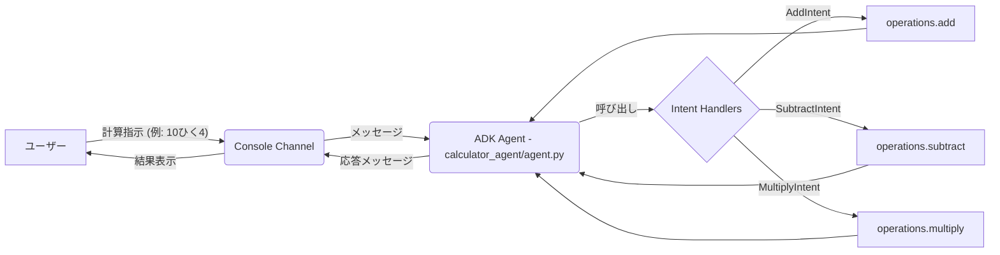

# 🧮 ADK 計算エージェント

ADK (Agent Development Kit) フレームワークを使用して構築された、自然言語による計算指示を理解し実行するエージェントです。足し算、引き算、掛け算に対応しています。

## ✨ 主な機能

*   **自然言語理解:** 「5たす3は？」、「10ひく4」、「2かける6」のような日本語の計算指示を解釈します。
*   **計算実行:** 足し算、引き算、掛け算を実行し、結果を返します。
*   **複数のインターフェース:**
    *   **Web UI:** Streamlit を使用したチャット形式の Web アプリケーション。
    *   **コンソール:** ターミナルから直接エージェントと対話可能。

## 🏗️ アーキテクチャ

このアプリケーションは、主に以下のコンポーネントで構成されています。

*   **ADK Agent:** 自然言語を解釈し、計算を実行するコアロジック。インテントハンドラーを使用して、ユーザーの意図（足し算、引き算、掛け算）を判断します。
*   **FastAPI:** Web UI からのリクエストを受け付けるバックエンド API サーバー。ADK エージェントのロジックをラップします。
*   **Streamlit:** ユーザーが計算を依頼するためのフロントエンド Web UI。FastAPI バックエンドと通信します。

**処理フロー (Web UI):**

```mermaid
graph LR
    A[ユーザー] -- 計算指示 (例: 5たす3) --> B(Streamlit UI);
    B -- HTTP POST /ask --> C(FastAPI API);
    C -- 処理依頼 --> D(adk_logic);
    D -- 応答生成 --> C;
    C -- JSON応答 --> B;
    B -- 結果表示 --> A;

    subgraph ADK Agent Logic (adk_logic.py)
        D -- 呼び出し --> E{Intent Handlers};
        E -- AddIntent --> F[adder_agent.add];
        E -- SubtractIntent --> G[subtractor_agent.subtract];
        E -- MultiplyIntent --> H[multiplier_agent.multiply];
        F --> D;
        G --> D;
        H --> D;
    end
```

**処理フロー (コンソール):**



## ⚙️ セットアップ

1.  **リポジトリのクローン:**
    ```bash
    git clone <repository_url>
    cd youtube-mcp/adk_calculator_agent
    ```

2.  **仮想環境の作成と有効化 (推奨):**
    ```bash
    python -m venv venv
    source venv/bin/activate  # Linux/macOS
    # venv\Scripts\activate  # Windows
    ```

3.  **必要なライブラリのインストール:**
    ```bash
    pip install -r requirements.txt
    ```

4.  **環境変数の設定:**
    `.env_sample` ファイルをコピーして `.env` ファイルを作成します。必要に応じて内容を編集してください (現時点では ADK 関連の設定が必要になる可能性がありますが、サンプルには具体的な変数がありません)。
    ```bash
    cp .env_sample .env
    ```

## ▶️ 実行方法

### コンソール版

以下のいずれかのコマンドで、ターミナル上でエージェントと対話できます。

```bash
python main_agent.py
```

または

```bash
python run.py
```

または

```bash
python -m calculator_agent.run
```

プロンプトが表示されたら、「5たす3は？」のように入力します。「quit」と入力すると終了します。

### Web UI 版

Web UI を使用するには、FastAPI バックエンドサーバーと Streamlit フロントエンドの両方を起動する必要があります。

1.  **FastAPI サーバーの起動:**
    ターミナルを開き、`adk_calculator_agent` ディレクトリで以下を実行します。
    ```bash
    uvicorn api:app --reload --host 127.0.0.1 --port 8000
    ```
    サーバーが `http://127.0.0.1:8000` で起動します。

2.  **Streamlit アプリの起動:**
    別のターミナルを開き、`adk_calculator_agent` ディレクトリで以下を実行します。
    ```bash
    streamlit run streamlit_app.py
    ```
    Web ブラウザで Streamlit アプリケーションが開きます。表示されたチャットインターフェースで計算を依頼できます。

## 📂 コード構成

```
adk_calculator_agent/
├── .env                  # 環境変数 (APIキーなど、git管理外)
├── .env_sample           # 環境変数ファイルのテンプレート
├── requirements.txt      # Pythonライブラリの依存関係リスト
├── README.md             # このファイル
├── main_agent.py         # コンソール実行用エージェント (独立した計算モジュールを使用)
├── adder_agent.py        # 足し算ロジック (main_agent, adk_logic から使用)
├── subtractor_agent.py   # 引き算ロジック (main_agent, adk_logic から使用)
├── multiplier_agent.py   # 掛け算ロジック (main_agent, adk_logic から使用)
├── api.py                # FastAPIバックエンドAPI定義
├── adk_logic.py          # FastAPIから呼び出されるADKエージェントロジック
├── streamlit_app.py      # StreamlitフロントエンドUI
├── run.py                # コンソール実行用ラッパースクリプト (calculator_agent を実行)
└── calculator_agent/     # 別の実装/構成の計算エージェントパッケージ
    ├── __init__.py
    ├── agent.py          # ADKエージェント定義 (operations.py を使用)
    ├── operations.py     # 計算関数 (足し算、引き算、掛け算)
    └── run.py            # calculator_agent パッケージのコンソール実行スクリプト
```

## 💡 今後の改善点

*   **コードの重複:** `main_agent.py`, `adk_logic.py`, `calculator_agent/agent.py` でインテントハンドラーの定義が重複しています。また、計算関数も `adder_agent.py` などと `calculator_agent/operations.py` で重複しています。これらを共通化することで、保守性が向上します。
*   **設定管理:** APIキーなどの設定を `.env` で管理する仕組みがありますが、現状では具体的な設定項目が少ないため、将来的な拡張に備えて整備が必要です。
*   **エラーハンドリング:** API やエージェント内のエラーハンドリングをより堅牢にすることができます。
*   **テスト:** ユニットテストや統合テストを追加することで、コードの品質と信頼性を高めることができます。
